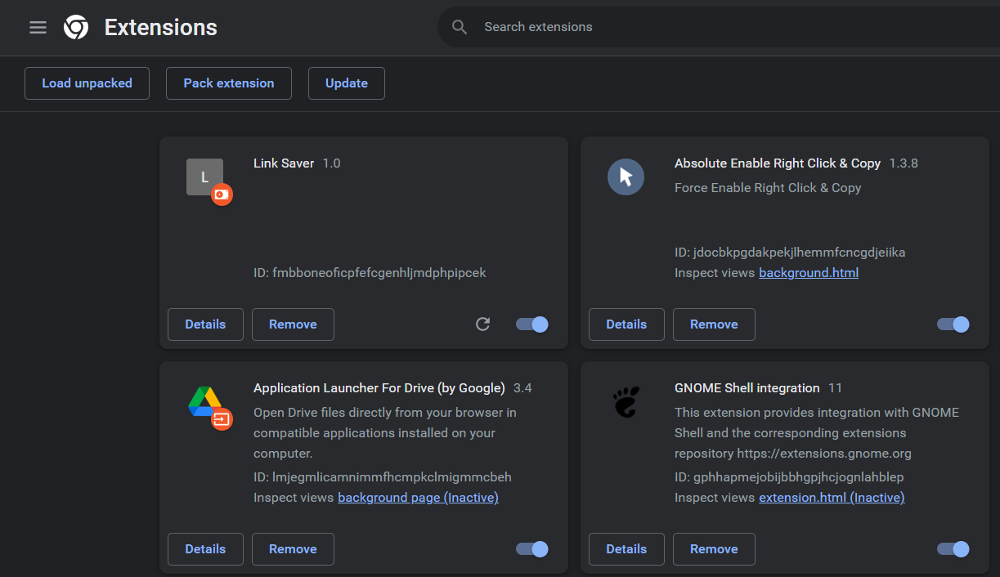

# Link Holder

Its an chrome extension, in which you can save important links in your local storage and you can visit your saved linkes anytime you open the extension.

## Adding to chrome browser
- Download this repository as zip file.
 
 

 
 

- Exctract the zip file in your desktop.
- Open Google chrome and go to  <a>chrome://extensions/</a>
- Click on Load unpacked button and provide the extracted file location.
 
 

 
 
- Now the extension is added to chrome, you can check it use the extension now.